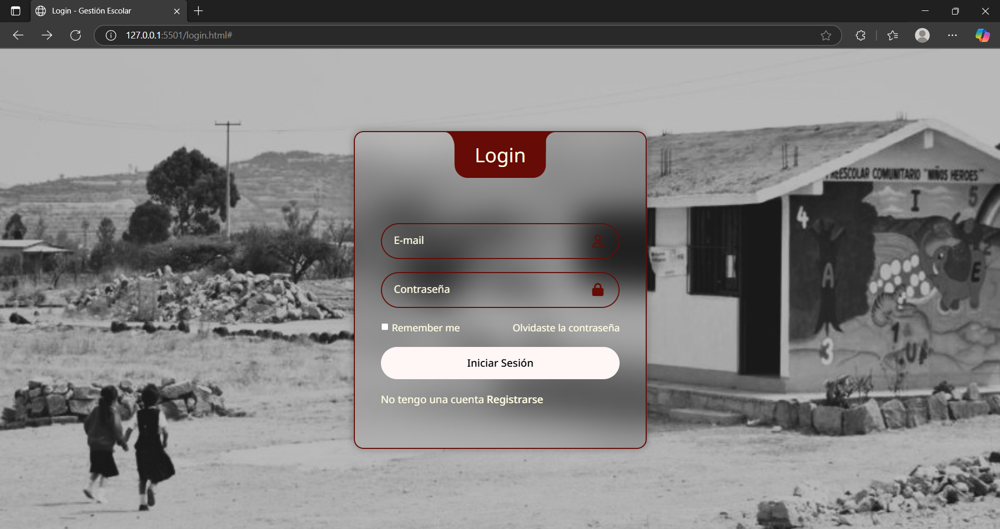
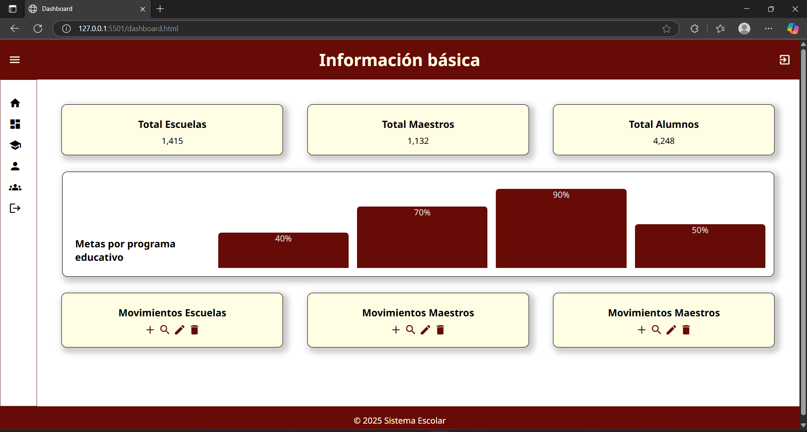
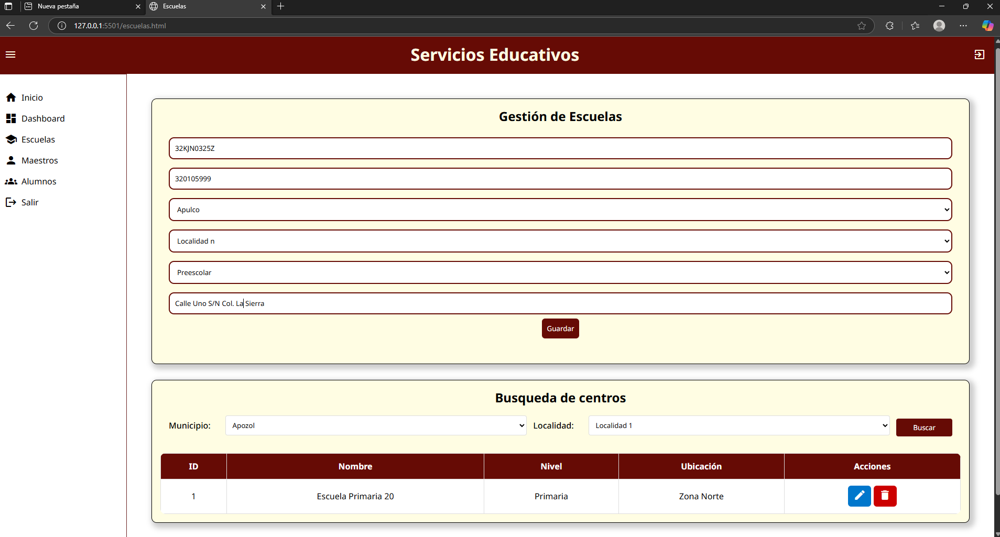

# Aplicación de *Design Thinking* a un Sistema de Gestión Escolar
Clase de Análisis y Diseño de Interfaces de Usuario

## 1. Introducción
La gestión de espacios escolares implica coordinar múltiples procesos: administración de escuelas, asignación de maestros, inscripción de alumnos, control de pagos, programación académica, etcétera. Las consecuencias negativas resultantes no solo generan retrasos y duplicación de tareas, sino que también dificultan significativamente la comunicación entre las distintas partes interesadas para este caso tenemos operadores/administradores del sistema, maestros, alumnos.

Solo mediante un enfoque iterativo continuo y revolucionario, basado en una comprensión profunda de las necesidades actuales de desarrolladores, gerentes, docentes, estudiantes y personal administrativo, se pueden implementar verdaderamente soluciones técnicas. Al abordar el tema con la metodología Design Thinking, podemos profundizar en diversos problemas, desarrollar eficazmente un conjunto de soluciones consolidadas y verificarlas y perfeccionarlas repetidamente antes de la implementación final, garantizando así la optimización de nuestro trabajo de desarrollo.

## 2. Objetivo
El presente documento tiene como objetivo describir cómo se aplicará la metodología ** Design Thinking** en el desarrollo de la aplicación de gestión de espacios escolares, detallando sus fases y la manera en que cada una contribuirá a obtener un producto útil y adaptable a las necesidades del entorno educativo.

Asimismo, busca alinear al equipo de desarrollo en torno a un enfoque común, garantizando que las decisiones de diseño, las funcionalidades y las prioridades del sistema estén siempre orientadas a mejorar la experiencia de los usuarios finales.
## 3. Metodología Desing Thinking 
### 3.1 Empatizar
1. Iniciamos con la identificación de los actores que intervienen en el contexto general del sistema, encontrando dos vertientes principales los operadores con sus diferentes perfiles y los usuarios.
    - **Operadores**: Administrador, auditor y operador.
    - **Usuarios**: Director, Maestro y alumno.
2. Se recopilo la información con entrevistas realizadas a algunos de los actores antes mencionados, así como, visorias del uso real del sistema existente.
### 3.2 Definir
Derivado de la recopilación de información, se detectaron necesidades prioritarias que ocupan la atención de mejoras o cambios significativos en los procesos.
Entre los que destacan que en sistemas existentes los distintos tipos de movimientos se hacían en diferentes módulos y para visualizar detalles de escuelas en específico era necesario acceder al módulo correspondiente, es decir, no se tiene interoperabilidad entre los módulos, lo que genera demasiados clicks para visualizar la información y por tal motivo era necesario llevar registros o apuntes extras para la consolidación de información. 
### 3.2 Idear
Tomando en cuenta la información recabada en las entrevistas y las observaciones de campo, se lograron concretar las siguientes ideas en beneficio de los distintos actores.
1. Mejorar el diseño de la base de datos para relacionar los registros y crear interoperabilidad real entre las entidades principales que intervienen en el sistema.
2. Crear una nueva interfaz que tenga las siguientes mejoras:
    - Crear barra de navegación rápida y sencilla.
    - Agregar "botones" de fácil acceso para crear, leer, modificar o borrar registros.
    - Agregar más entradas para realizar el filtrado y por tanto búsquedas de servicios escolares.
    - Mejorar la visualización de la información de manera conjunta aprovechando la nueva estructura de la base de datos.
Como primeros pasos se busca la solución a estas necesidades, sin embargo, conforme se presenten los prototipos podrán ir mejorando.
### 3.4 Prototipar
Para el prototipado inicial se generaron las pantallas en HTML usando CSS para los estilos de las siguientes pantallas esenciales:
- Login (Inicio de sesión)
- Dashboard (pantalla principal con estadísticas y acceso directo a las páginas)
- Escuelas (con estructura básica de registro y búsqueda) 

Se eligieron estas pantallas debido a que se considera que las subsecuentes tendrán la misma estructura únicamente cambiando los conceptos para búsqueda o registro dependiendo del tipo de entidad.

### 3.5 Testear
El testeo por lo pronto queda pendiente hasta no ser programado con los usuarios una reunión dónde se presenterán los prototipos generados, para su revisión y análisis.

## 4. Beneficios
La implementación de Design Thinking en el desarrollo de la aplicación permitirá que el sistema se diseñe y ajuste de acuerdo con las necesidades reales de la comunidad escolar. Entre los beneficios principales se encuentran los siguientes:

* Solución centrada en el usuario final: la aplicación integrará funcionalidades alineadas con los requerimientos de directores, maestros, alumnos y personal administrativo.

* Mayor adopción de la aplicación: al involucrar a los usuarios en todo el proceso de diseño y prueba, se genera confianza y se incrementa la disposición a utilizar la herramienta.

* Reducción de errores y reprocesos: el prototipado y las pruebas tempranas permitirán identificar y corregir problemas antes de la implementación final, optimizando tiempos y recursos.

* Incremento en la eficiencia de la gestión escolar: la solución facilitará la coordinación de actividades, la organización académica y la comunicación entre los distintos actores del sistema educativo.
## 5. Conclusiones
La aplicación de Design Thinking en este proyecto asegura que el desarrollo de la plataforma no se limite a un enfoque técnico, sino que responda directamente a los desafíos y expectativas de los usuarios escolares.

Su relevancia radica en que promueve la innovación centrada en las personas, garantizando que el producto final sea útil, práctico y adaptable a diferentes contextos educativos.

El equipo de desarrollo se compromete a aplicar las fases de Design Thinking de manera iterativa, fomentando un proceso flexible y colaborativo que incremente las probabilidades de éxito del proyecto.
## 👥 Autor
- Crystian Muro - Ingeniería de Software 5° "D" UAZ.
